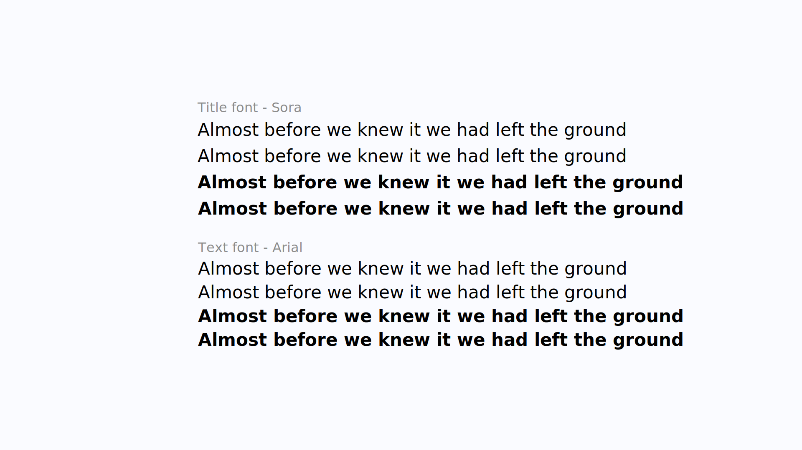

# Site internet du bachelier en web de la HEPL
## Le contexte
Actuellement, la représentation du bachelier en web de la HEPL sur internet se limite à [ une page sur le site de la HEPL ](https://www.hepl.be/fr/techniques-infographiques/web). Cette page informative ne montre que très peu de la formation et n'en rend pas une idée claire.  
En se limitant à ça, on pourrait penser que la formation d'une autre école [ celle de la HEAJ par exemple ](https://www.heaj.be/fr/formations/bacheliers/1ere-bac-techniques-infographiques/design-web-mobile/) est meilleure car leur site la rend plus attrayante et compréhensible.
Le site actuel ne permet pas non plus de s'informer sur la section, on ne sait pas vraiment ce qui s'y passe, qui sont les professeurs, quels travaux on sera amené à realiser.

## Les objectifs
- **Présenter la formation:** rendre clair et concret ce qui attend un étudiant qui commencerait la formation. Expliquer les differents cours de manière détaillée et présenter les professeurs qui les donnent.  
La philosophie de la formation, la qualité web, sera également présentée car c'est un réel avantage competitif sur les autres écoles.
- **Faciliter les interractions avec le résau d'entreprises:** les entreprises pourront passer par le site pour proposer des offres de stage et reperer des étudiants.
- **Présenter les métiers:** montrer ce qu'il est possible de devenir a la suite de la formation. Par exemple en présentant les anciens étudiants et ce qu'ils sont devenus.
- **Montrer les réalisations des étudiants:** pendant les deux années, les étudiants sont amenés à réaliser des designs et des sites. Il sera plus facile pour les nouveaux étudiants de réaliser ce qu'ils vont faire dans la formation en voyant ce qui à déjà été fait.
- **Créer un espace de discution et de contact:** les nouveaux étudiants pourront se renseigner facilement directement auprès des étudiants actuels, des anciens et des professeurs.
- **Informer sur la formation:** parler des différentes activités de la formation, ce qu'il si passe en général (sous forme de blog par exemple).

## Le public cible
Les cibles du projet sont les futurs étudiants, les étudiants actuels et les entreprises.

## Le périmetre du projet
Le site sera multilingue (français, néerlandais, allemand, anglais).  
Il sera également responsive, tant au niveau des images que de la mise en page.  
Le site fonctionnera, bien évidemment, sur les différents navigateurs.  
Les guidelines du WCAG (niveau AA) seront respectées.  

## Les technologies utilisées
Les languages de programation utilisées seront:
- l'*HTML* pour baliser la page de manière sémantique. Des microdatas seront également incluses afin d'ameliorer le SEO du site.
- Le *CSS* pour mettre la page en forme et lui donner du style. Les propriétés utilisées, si elles ne sont pas compatibles avec certains navigateurs auront un fallback.
- Le *javascript* pour rendre la page dynamique et améliorer l'expérience de l'utilisateur. Le site fonctionnera cepandant même si le javascript est désactivé pour s'accomoder à tout types d'utilisateurs.
- Du *PHP* pour gerer toute la partie backend (logique serveur) du projet. Le framework *Laravel* sera utilisé pour rendre le backend robuste et correctement fonctionnel.
- L'administration du site se fera (probablement) à l'aide de *nova*, un tableau de bord d'administration qui permet d'éditer le contenu du site.

## La charte graphique
Le processus en ce qui concerne le design sera le suivant.  
Tout d'abord il y aura une phase de recherche, d'inspiration. En regardant d'autres sites je pourrais me donner une idée de ce qui existe déja et en dégager les points forts et faibles pour garder ce qui est meilleur et changer ce qui ne va pas.  
Ensuite viendra la phase de prototypage, d'abord sous forme textuelle avec des liens qui lient des pages entre elles pour se rendre compte de l'architecture du site. Apres, je réaliserais des prototypes papiers et/ou de wireframes (Prototypes de basse fidélité) pour pouvoir me donner une idée du layout et de l'expérience utilisateur.
La partie suivante est la réalisation de maquettes graphiques et interactives pour représenter de manière fidèle le site.

### Les couleurs

Les couleurs utilisées sont volontairement peu nombreuses car je pense qu'un site simple et épuré qui met plutot l'accent sur le texte pourrait permettre de mieux communiquer l'information.  
Cependant d'autres couleurs (à déterminer) seront utilisées pour attirer l'attention sur des détails spécifiques.

## Les polices

Les polices choisies pour le site sont Sora et Arial. Sora à été choisie comme police pour le titrage car je trouve qu'elle à une personnalité assez "web", "technologique", sans pour autant rentrer dans le stéréotype de la police à chasse fixe.  
Arial est la police qui sera utilisée pour le gros du contenu. Elle à été choisie car c'est une police stable et connue du public, son but n'est pas d'attirer l'attention mais simplement de transmettre l'information.  
Les deux polices ont aussi été pensées sur le plan environemental.
Sora est variable, ce qui veut dire qu'il n'y à qu'un fichier à télécharger pour les différentes variantes de la police. Arial quant à elle est une polce instalée par défaut sur la majorité des ordinateurs, ce qui veut dire qu'il ne faudra même pas que l'utilisateur la télécharge. Ces deux choses combinées permettent d'économiser de l'énergie ce qui va réduire la quantité de CO2 produite lors de l'utilisation du site.  

Voici un exemple d'utilisation de ces polices dans une vue de type "blog".

### Ce qu'on trouve sur le site
- **La page d'accueil:** sur la page d'accueil, on devra retrouver une présentation du bachelier et de sa philosophie. Les autres pages (Blog, Forum, Travaux étudiants,...) y seront introduites avec des liens permettant d'y accéder.

- **La page de blog:** sur cette page, on pourra trouver l'actualité du bachelier et des articles interessants écrits par les membres de la formation.

- **La page forum:** la page forum permettra à tous de discuter, poser des questions. Un système d'upvote à la [ reddit ](https://www.reddit.com) ou [ stack overflow ](https://github.com/theoLeonet/documentation_web_hepl/blob/main/images/font_ex_blog_post.svg?raw=true) pourrait être mis en place à fin d'organiser le contenu.

- **La page entreprise:** sur la page entreprise, on pourra trouver des offres de stages proposées par les entreprises qui seront au préalable vérifiées et acceptées par l'administration du site. Cette page pourrait aussi servir de présentation pour certaines entreprises, notemment celles des anciens.

- **Les pages de présentation des projets**: les projets des étudiants seront présentés de manière détaillée sur ses pages ([un peu de cette façon](https://christy-hu.com/nickelodeon/index.html)). 

- **Les pages de présentation des professeurs:** on pourra y trouver des informations sur les professeurs, leur parcours, des fun facts, la matière qu'ils enseignent,...

- **Les pages de présentation des anciens:** ses pages permettront de mettre en lumière les débouchés qu'amènent la formation. Ce sera aussi une façon de découvrir le type de profil qui sort du bachelier et les personnes qui seront (peut-être) les futurs maitres de stage des visiteurs.
- **Le footer**: dans le footer de chaque page on pourra trouver une section pour s'inscrire à la newsletter du site ainsi qu'un formulaire de contact.

### La date de remise
Le site sera rendu pour le jury de l'examen de janvier. La date précise reste à déterminer.

### L'estimation du prix
Le prix estimé est de 3000€. (Si on prend en compte que le projet prendra environ 300h, cela revient à payer 10€ de l'heure. Autrement dit, 1000€ par mois.)
